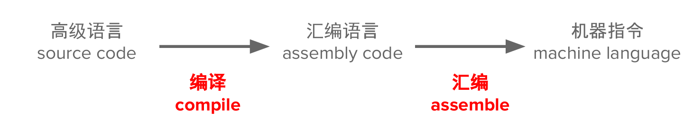
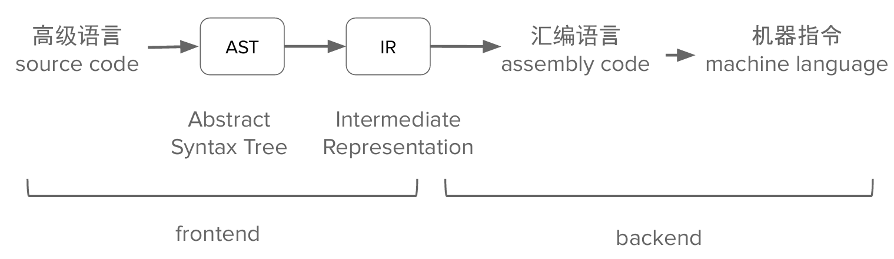
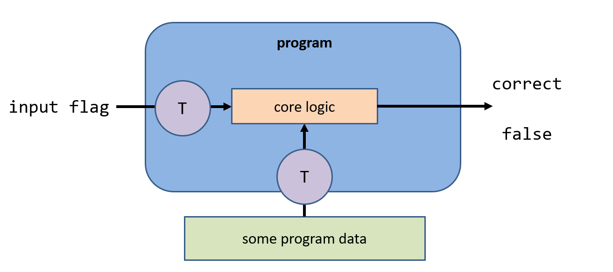
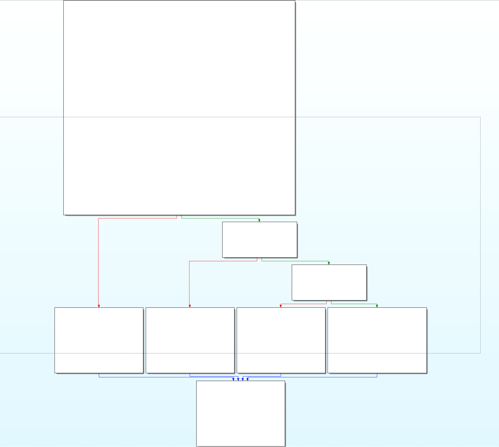
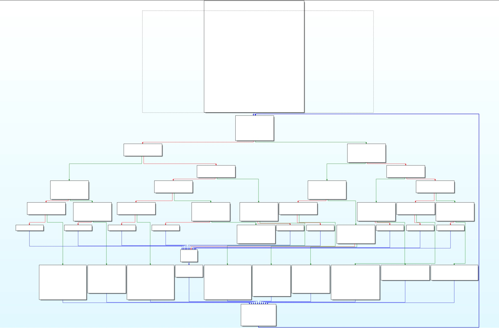
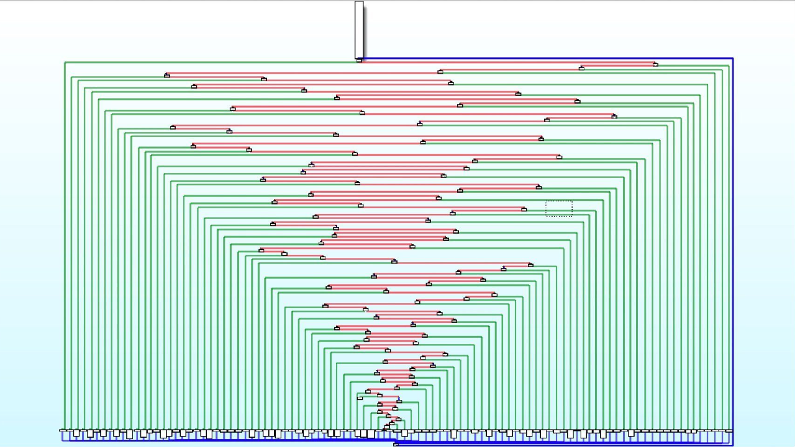

<div class="middle center">
<div style="width: 100%">

# Reverse基础⚙️

---

黄一航 @huayi  2025.7.4

</div>
</div>


<!--s-->


<div class="middle center">
<div style="width: 100%">


# Part.0 准备工作

</div>
</div>

<!--v-->


## 准备工作

一些需要安装的工具

- linux环境(wsl/vmware)
- Python环境
    - z3-solver
- IDA
- GDB


<!--v-->


## 关于逆向

- 一杯茶、一包薯片、一个逆向做一天😭
- 赛题加密部分涉及密码学、数学知识；学无止境
- 大量可用工具；学无止境 plus
- 逆向核心逻辑十分复杂枯燥；学无止境 plus++

- 与开发联系紧密 
    - 语言 C/C++ Python Java C# Javascript go 以及各种汇编语言
    - 平台 Linux Windows Macos 跨平台
    - 架构 x86 ARM

<!--v-->


## 逆向参考资料
- 参考网站
    - 看雪论坛 https://www.kanxue.com/ 
    - 吾爱破解 https://www.52pojie.cn/ 
    - CTF Wiki https://ctf-wiki.org/
- 练习平台
    - ZJU校巴 https://zjusec.com/
    - BUUCTF https://buuoj.cn/
    - NSSCTF https://www.nssctf.cn/


<!--v-->


## 逆向课内容介绍

- 逆向基础 程序编译执行 工具使用 约束求解等

- 逆向专题1 游戏/异架构逆向

- 逆向专题2 自动逆向

<!--v-->


## 逆向基础课内容
- 预处理、编译、汇编、链接
- 静态分析工具IDA使用
- 动态分析工具
    - linux gdb
    - windows x32dbg/x64dbg Ollydbg
- 约束求解z3-solver
- 简单介绍
    - 代码混淆
    - 壳


<!--s-->


<div class="middle center">
<div style="width: 100%">


# Part.1 程序编译和执行流程

</div>
</div>

<!--v-->


## 编译 vs 汇编
- 编译(compile): 高级语言->汇编语言
- 汇编(assemble): 汇编语言->机器语言

<!--  -->



- 反汇编: 汇编语言->机器语言 （查表 准确）
- 反编译: 高级语言<-汇编语言 （不准确）

<!--v-->
## 编译(汇编) vs 链接
- 编译(汇编): 从源代码->目标文件
- 链接: 目标文件->可执行文件

<!--v-->

## 例0 使用gcc编译hello.c
```sh
sudo apt install gcc
```
- file 查看文件的类型
- readelf 查看elf文件信息
```sh
# 仅预处理； 不要编译、汇编或链接
gcc -E hello.c -o hello.c.i

# 只编译； 不要汇编或链接
gcc -S hello.c

# 编译和汇编，但不链接。
gcc -c hello.c

# 编译、汇编和链接
gcc hello.c -o hello
```


<!--v-->


## 俯瞰一下逆向的赛题


<!--s-->

<div class="middle center">
<div style="width: 100%">


# Part.2 工具使用和例题讲解

</div>
</div>

<!--v-->


## IDA

- 常用的快捷键
    - 反编译 `F5`
    - 查看字符串 `Shift+F12`
    - 交叉引用 `x`
    - 地址跳转 `g`
  
<!--v-->

## GDB
- GDB
- 推荐pwndbg/gef等等改版
- 运行 r
- 打断点 b
- 继续运行 c
- 步进 s
- 步过 n

<!--v-->


## 例1 lab0 crackme
- 再次审视一下这个程序的结构 

<!--v-->


## 例2 简单的异或
- [校巴Reverse1](https://zjusec.com/challenges/26)
```
a ^ b ^ b == a

```
<!--v-->


## 休息一下吧

<!--v-->

## 例3 base64
- HUBUCTF2022 新生赛 simple_RE
- base64解密

```py
import base64
import string

c = "RjS2WUGwWS80U2W1yfB="

s1 = "ZYXABCDEFGHIJKLMNOPQRSTUVWzyxabcdefghijklmnopqrstuvw0123456789+/"
s2 = "ABCDEFGHIJKLMNOPQRSTUVWXYZabcdefghijklmnopqrstuvwxyz0123456789+/"

print(base64.b64decode(c.translate(str.maketrans(s1,s2))))
```


<!--s-->


<div class="middle center">
<div style="width: 100%">


# Part.3 约束求解和z3-solver

</div>
</div>

<!--v-->


## z3-solver

- z3是一个微软研究院开源的theorem prover(定理证明器)，支持位向量、布尔、数组、浮点数、字符串以及其他数据类型。

```shell
$ pip3 install z3-solver
```

- z3求解线性约束方程

```py
from z3 import *
x,y,z=Ints('x y z')
s=Solver()
s.add(2*x+3*y+z==100)
s.add(x-y+2*z==-10)
s.add(x+2*y-z==212)
print(s.check())
print(s.model())
```


<!--s-->


<div class="middle center">
<div style="width: 100%">


# Part.4 代码混淆和壳

</div>
</div>
<!--v-->


## 代码混淆
- 混淆->用于增加理解和反编译难度
- 花指令（junk code）是一种专门用来迷惑反编译器的指令片段，这些指令片段不会影响程序的原有功能，但会使得反汇编器的结果出现偏差，从而使破解者分析失败。如利用jmp 、call、ret 指令改变执行流
- 自修改代码（Self-Modified Code）是一类特殊的代码技术，即在运行时修改自身代码，从而使得程序实际行为与反汇编结果不符。
- 控制流平坦化 ollvm

<!--v-->
## ollvm

<div style="display: flex; justify-content: space-around;">
  
  
  
</div>

- 🤔----------ollvm---->😠💢------------->😭👊

<!--v-->

## 壳
- 压缩壳: Upx、PECompat
- 加密壳: VMProtect
- 自动化工具脱壳
- 手动脱壳 用动态调试工具如ollydbg

<!--s-->
<div class="middle center">
<div style="width: 100%">


# Part.5 其他

</div>
</div>


<!--v-->


## 展望
- 对于陌生的概念，勤查资料，利用好搜素引擎和AI大模型

- 了解一下idapython脚本

- 了解下加壳和脱壳技术

- 了解常见混淆技术

- 了解更多编程语言、架构和平台的逆向 可以从游戏出发（逆向专题1的前瞻）

- 尝试练习一下约束求解工具z3-solver （逆向专题2的前瞻）


<!--v-->


## 作业 reverse lab1

- 基础：
    - Challenge 1: 复现hello.c的编译执行流程 撰写操作报告
    - Challenge 2: 熟悉IDA和GDB的操作 撰写操作报告
    - Challenge 3: 复现课上的题目例2例3 并在报告中描述思路和流程

- 挑战：
    - Challenge 4: 完成circuit(用z3-solver) 
    - Challenge 5: 完成[校巴reverse3](https://zjusec.com/challenges/24) (来试试C# 用ILSpy和线性代数)


<!--v-->


## 预告

- 逆向专题1 游戏/异架构逆向 @huayi
    - 异架构以及不同语言的逆向->本质 各种架构介绍
    - 游戏逆向->目的 对示例游戏的编写语言、运行平台进行分析
    - 6502汇编 NES （BeginCTF红白机）
    - Javascript逆向（JS游戏+代码混淆）
    - Windows下的游戏逆向（pvz CE）
    - Python逆向（反编译pyc）
    - 早期Java游戏
    - Unity游戏逆向（C# dnspy）

<!--v-->

## 预告
- 逆向专题2 "自动"逆向技巧 @f0rm2l1n 
    - 引言：人工密集型的逆向过程
    - 基础：符号执行器基础 - 以 angr 为例
    - 实战：符号执行用于自动化逆向
    - 反思：符号执行存在的不足
    - 拓展：其他"自动"化技巧探讨
<!--s-->


<div class="middle center">
<div style="width: 100%">


# 谢谢大家

---

# questions?

</div>
</div>